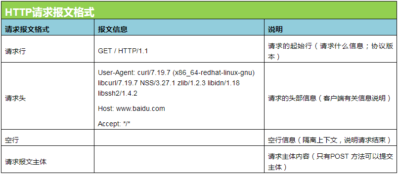
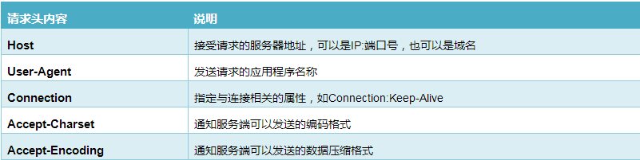
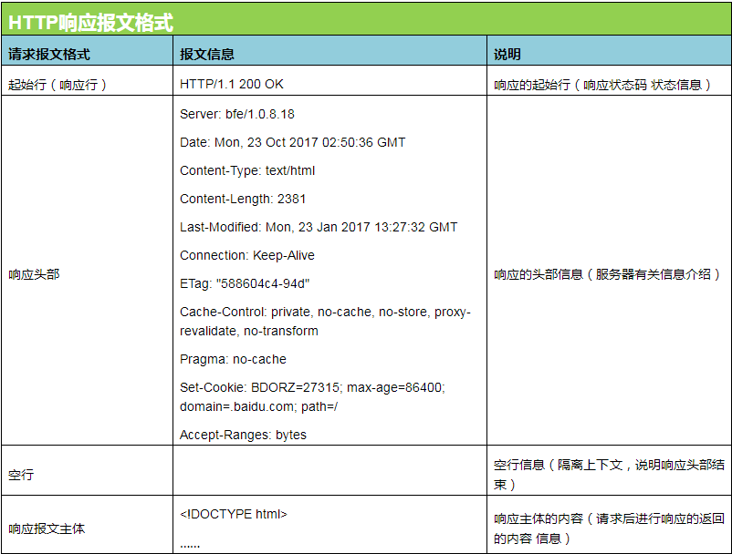
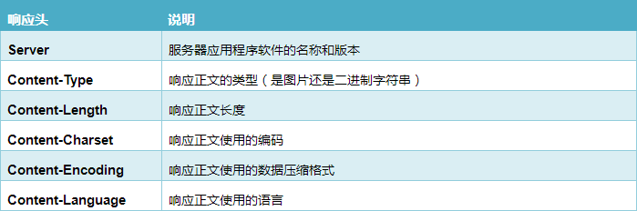

#HTTP服务原理
[TOC]
###1. 用户访问网站流程
1. 进行域名信息的DNS解析
2. 进行与网站服务器简历连接,tco三次握手过程
3. 和网站服务器数据传输过程(http协议--请求过程)
4. 和网站服务器数据传输过程(http协议--响应过程)
5. 进行与网站服务器断开连接,tcp四次挥手过程

####1.1 DNS解析原理
> 01. 先查看hosts文件有没有域名与IP对应记录
> 02. 本地主机向local DNS服务器(网卡上指定配置的DNS服务器)发出请求
> 03. local DNS服务器接收到主机的请求,查询本地缓存信息
> 04. local DNS服务向根域名服务器请求,向顶级/二级域名服务器请求(迭代查询)
> 05. 获取到域名与IP地址的对应关系,这是通过授权DNS服务中获取得到的,local DNS服务器进行缓存该信息,再发送给客户端主机
> 06. 客户端主机接收到信息,进行本地缓存,根据信息中记录的IP地址信息,进行网络访问.

###2. HTTP协议知识
####2.1 什么是HTTP协议
  HTTP协议名超文本传输协议,是互联网中最常用的一种协议,它最初的设计目的就是提供一种发布和接受HTML页面的方法.HTTP协议的应用很多,但最流行的是应用与Web浏览器和Web服务器之间的通信,即WWW应用或称Web应用.HTTP协议的WWW服务应用默认端口是**80**,另外一个加密的服务应用https的默认端口为**443**.

####2.2 HTTP版本协议
+ HTTP/1.0 规定浏览器和服务器只保持短暂的连接(TCP短链接)
+ HTTP/1.1 支持持久连接,在一个TCP连接上可以传送多个HTTP请求和响应,减少了建立和关闭连接的消耗和时间延迟(TCP长连接)

###3. HTTP协议原理过程
在linux系统中查看报文的方法(curl命令先安装 sudo apt install curl)
> crul -v  ---显示访问域名请求报文与想要报文信息
> crul www.baidu.com -v
\> 表示http请求报文 <表示http的响应报文

####3.1 响应http请求方法
|HTTP方法|作用描述|
|:-----------------|:------------------------|
|GET|客户端请求指定资源信息,服务器返回指定支援|
|HEAD|只请求响应报文中的HTTP首部|
|POST|将客户端的数据提交到服务器,例:注册表单|
|PUT|用从客户端向服务器传送的数据取代指定的文档内容.|
|DELETE|请求服务器删除Request-URI所表示的资源|
|MOVE|请求服务器将指定的页面移至另一个网络地址|
####3.2 http请求过程

####3.3 请求头信息说明

####3.4 http响应过程

####3.5 响应头信息说明

